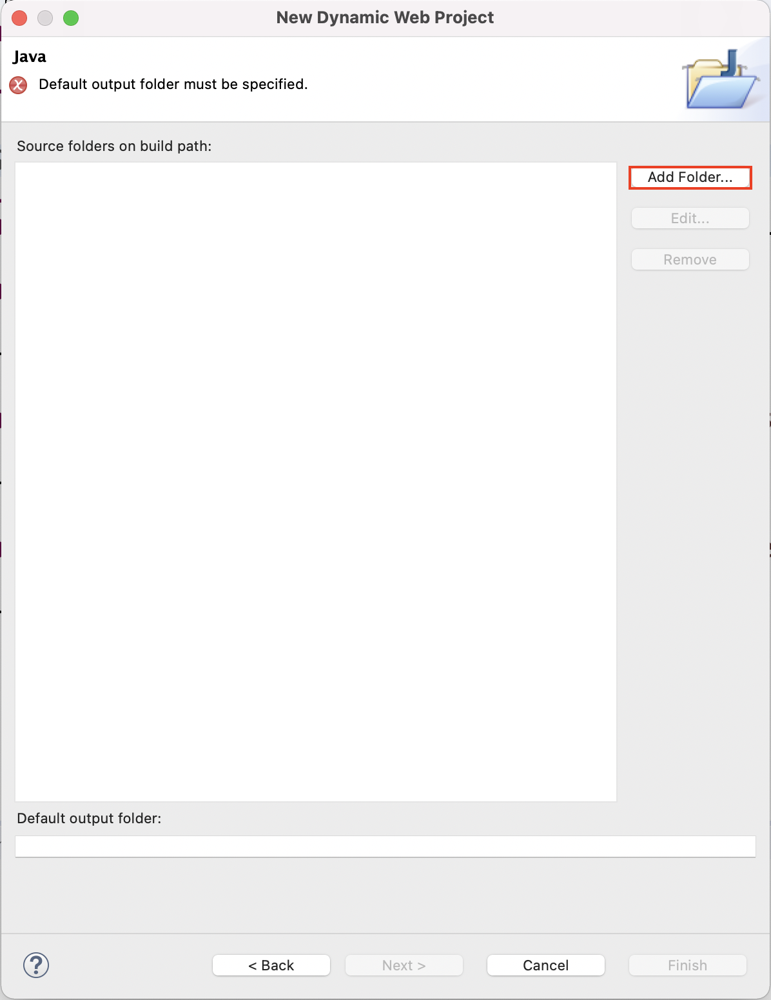

# Hướng dẫn tạo Dynamic Web Project trong Eclipse

## B1. Tạo Dynamic Web Project

- Chọn `File -> New -> Dynamic Web Project`:

## B2. Đặt tên project & chọn cấu hình Apache Tomcat tương ứng

- Sau khi cấu hình đầy đủ thông tin, chọn **Next**

## B3. Cấu hình thư mục mã nguồn (src)

- Nhấn **Remove** để xóa bỏ cấu hình đường dẫn mặc định (trống) của project.

- Click **Add Folder**:

- Đặt tên cho thư mục mã nguồn (làm theo đúng như hình):

- Sau đó nhấn **OK**

## B4. Cấu hình thư mục output
- Cấu hình thư mục output như trong hình:

- Sau khi cấu hình xong, chọn **Next**:

## B5. Hoàn tất cài đặt

- Cấu hình **Content directory** & chọn `Generate web.xml deployment descriptor` như trong hình:

- Sau đó chọn **Finish** để hoàn tất tạo mới & cấu hình *Dynamic Web Project*

## Cấu trúc thư mục của 1 Dynamic web project:
- https://help.eclipse.org/latest/index.jsp?topic=/org.eclipse.wst.webtools.doc.user/topics/ccwebprj.html
